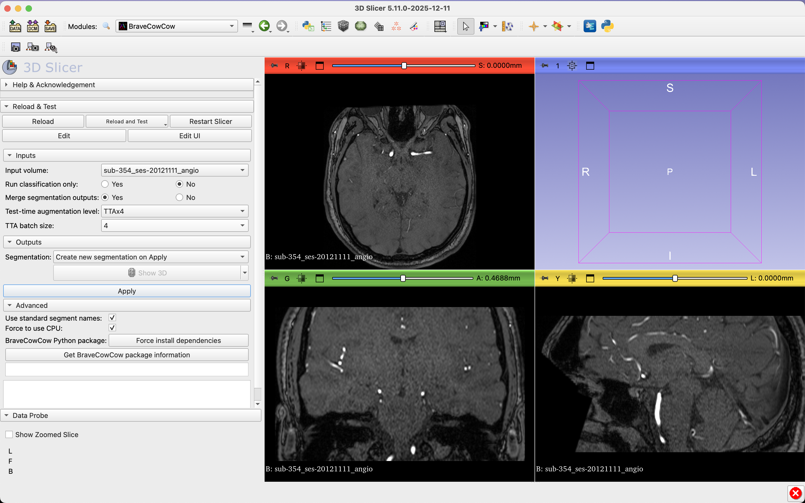
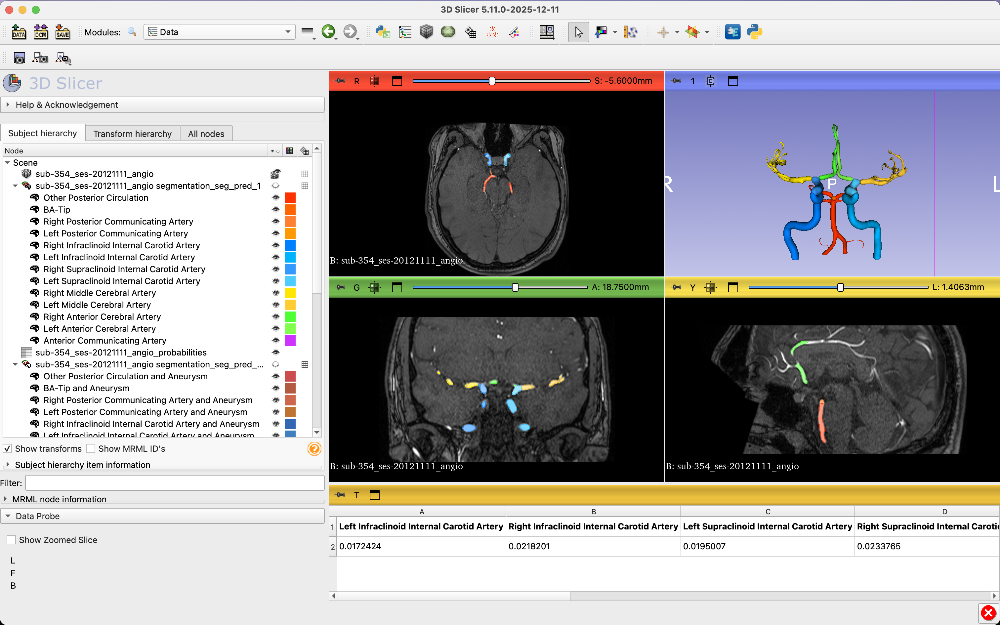

# BraveCowCow 3D Slicer Plugin
This repository provides the 3D Slicer extension for **BraveCowCow**, enabling fast and accurate intracranial vessel segmentation and aneurysm detection directly inside 3D Slicer.




**BraveCowCow** implements a fast 2D tri-axial ROI extraction combined with 3D multi-task segmentation and classification for intracranial vessel analysis. 

🎉 This algorithm achieved **2nd place** in the **RSNA 2025 Intracranial Aneurysm Detection Challenge**.

👉 This repository focuses on the 3D Slicer plugin, providing an easy-to-use interface for clinical and research workflows in vascular imaging.

## Useful Links
- [🏆 RSNA 2025 Challenge Solution Write-up](https://www.kaggle.com/competitions/rsna-intracranial-aneurysm-detection/writeups/2nd-place-solution)
- [🔧 BraveCowCow Code Repository](https://github.com/huanghoujing/bravecowcow_inference_docker)
- [📠 Inference Demo](https://www.kaggle.com/code/pengchengshi/bravecowcow-2nd-place-inference-demo)
- [🛠 BraveCowCow 3D Slicer Plugin](https://github.com/murong-xu/SlicerBraveCowCow)
- [🌐 TopCoW Challenge](https://topcow24.grand-challenge.org/)
- [🧠 TopBrain Challenge](https://topbrain2025.grand-challenge.org/)

If you use this software and find this work useful, please cite:

```bibtex
@article{shi2026intracranialaneurysmclassificationsegmentation,
  title={Intracranial Aneurysm Classification and Segmentation via Tri-Axial ROI and Multi-Task Learning},
  author={Pengcheng Shi and Kaiyuan Yang and Houjing Huang and Jiawei Chen and Yan Lu and Jiaqi Liu and Murong Xu and Bjoern Menze and Xinglin Zhang},
  journal={arXiv preprint arXiv:2606.26706},
  year={2026}
}
```

## Installation
1. **Install 3D Slicer**  
   Download and install the latest version of [3D Slicer](https://download.slicer.org/).  
   Compatibility note (verified on 2025-12-18): Our extension has been tested with preview release **5.11.0**.

2. **Install PyTorch**  
   Slicer makes it easy to set up the correct PyTorch version:  
   - Open `Extension Manager` in Slicer → search for `PyTorch` → click `Install`.  
     (Slicer will ask you to restart after installation.)  
   - After restarting, go to the `PyTorch Utils` module.  
     In the `Torch version requirement` box, type <mark>>=2.1.2</mark>. 
     In the `TorchVision version requirement` box, type <mark>>=0.17.2</mark>. 
     Then click `Install PyTorch`. Any PyTorch version <mark>>=2.1.2</mark> with its compatible TorchVision should work correctly.

3. **Install BraveCowCow Extension**  
   - ~~Open `Extension Manager` → search for `BraveCowCow` → click `Install`.
     (Again, restart Slicer after installation.)~~
   - ~~Once restarted, open the `BraveCowCow` module in Slicer and you should see the user interface ready to use.~~

   🚧 **In progress**: Installing BraveCowCow directly through the 3D Slicer Extension Manager is in progress.  
   In the meantime, please use the manual installation described below:
   - Clone this repository to your machine: 
      - `git clone https://github.com/murong-xu/SlicerBraveCowCow.git`
      - Or simply download it from https://github.com/murong-xu/SlicerBraveCowCow
   - Tell Slicer where to find it:
      - Open 3D Slicer
      - Go to `Edit` (the very top-left corner) → `Application Settings` → `Modules`.
      - Under `Additional module paths`, click the `arrow` on the right, then hit `Add`.
      - Navigate to the **SlicerBraveCowCow** folder you just downloaded, open it, and select the **BraveCowCow** subfolder.
      - Press OK and restart Slicer.
   - Once restarted, open the `BraveCowCow` module in Slicer and you should see the user interface ready to use.
   - On first use, the extension will automatically download and install required Python dependencies (this may take a few minutes).

## Quick Start
1. **Open the BraveCowCow extension** in 3D Slicer.  
2. **Load your image file**, including CTA, MRA, T1 post-contrast, or T2-weighted MRI (DICOM or NIfTI).  
3. **Set the input parameters:**  
   - **Input volume**: The image you want to analyze.  
   - **Run classification only**: 
     - `No` (default): Perform both segmentation and classification.
     - `Yes`: Only perform classification (faster, returns probability scores only).
   - **Merge segmentation outputs**: 
     - `No` (default): Generate only separate vessel and aneurysm segmentations.
     - `Yes`: Generate also a combined vessel+aneurysm segmentation.
   - **Test-time augmentation level**: Choose test-time augmentation strategy:
     - `TTAx1`: Fastest (single inference).
     - `TTAx4`: Balanced (4 augmentations).
     - `TTAx8`: Most accurate (8 augmentations).
   - **TTA batch size**: Number of augmentations to process in parallel (options depend on TTA type above).
   - **Advanced options**: 
     - `Use standard segment names` (default: *Yes*): Displays full anatomical names for vessel structures.  
     - `Force to use CPU` (default: *No*): Runs inference on CPU if you don't have a GPU.  
       ⚠️ **Note**: CPU mode can be slower than GPU.
     - **BraveCowCow Python package**:  
       - `Force install dependencies`: Re-installs the BraveCowCow package.  
       - `Get package information`: Shows the current BraveCowCow package version.
4. **Run**: Click `Apply`, and BraveCowCow will begin analyzing the input image.  
5. **View the results:**  
   - **Classification**: Aneurysm probability scores are displayed in a pop-up table window.
   - **Segmentation**: Up to 3 segmentation files may be generated depending on your settings:
     - `seg_pred_1`: Separate vessel and aneurysm labels (14 structures)
     - `seg_pred_2`: Combined vessel+aneurysm labels (13 structures)
     - `seg_pred_26fgCls`: Fine-grained classification with separated aneurysm locations (26 structures)
   - Navigate to the `Data` tab to view the list of segmented structures.
   - View segmentations in 2D slices or drag them into the 3D viewer panel.

## Target Structures

BraveCowCow segments and classifies the following intracranial vascular structures:

### Vessels (Circle of Willis)
- **Posterior Circulation**: 
  - Other Posterior Circulation
  - Basilar Tip (BA-Tip)
  - Posterior Communicating Arteries (Left/Right)
- **Internal Carotid Arteries (ICA)**:
  - Infraclinoid ICA (Left/Right)
  - Supraclinoid ICA (Left/Right)
- **Middle Cerebral Arteries (MCA)**: Left/Right
- **Anterior Cerebral Arteries (ACA)**: Left/Right
- **Anterior Communicating Artery (AComm)**

### Aneurysms
- Generic aneurysm detection
- Location-specific aneurysm classification (13 locations in fine-grained mode)

### Output Modes
1. **Standard mode** (`seg_pred_1`): 14 classes - 13 vessel segments + generic aneurysm
2. **Merged mode** (`seg_pred_2`): 13 classes - vessel+aneurysm combined labels
3. **Fine-grained mode** (`seg_pred_26fgCls`): 26 classes - 13 vessels + 13 location-specific aneurysms

## Algorithm Overview

BraveCowCow uses a two-stage approach:
1. **Stage 1 - ROI Extraction**: Fast 2D tri-axial vessel ROI detection to focus computational resources
2. **Stage 2 - Multi-Task Segmentation**: 3D deep learning for:
   - Vessel segmentation (Circle of Willis)
   - Aneurysm detection and classification
   - Location-specific aneurysm labeling

**Key Features**:
- Test-Time Augmentation (TTA) for improved accuracy
- Multi-task learning for simultaneous segmentation and classification
- Efficient ROI-based processing for faster inference
- Flexible output modes for different clinical needs

## Acknowledgements

**Core Algorithm Development**:
- Kaiyuan Yang, Houjing Huang (University of Zurich)
- Pengcheng Shi, Yan Lu, Jiawei Chen (Medical Image Insights, Shanghai)

**3D Slicer Extension**:
- Murong Xu (University of Zurich)

**Related Challenges**:
This work is affiliated with the MICCAI [TopCoW](https://topcow24.grand-challenge.org/) and [TopBrain](https://topbrain2025.grand-challenge.org/) challenges, which benchmark segmentation of the Circle of Willis and whole-brain vessel anatomy.

## License and Citation

- **Codebase** (the `bravecowcow` package and all source code in this repository) is licensed under the Apache License 2.0.
- **Model weights** are licensed under the Apache License 2.0.

If you use BraveCowCow in your research, please cite:

```bibtex
@article{shi2026intracranialaneurysmclassificationsegmentation,
  title={Intracranial Aneurysm Classification and Segmentation via Tri-Axial ROI and Multi-Task Learning},
  author={Pengcheng Shi and Kaiyuan Yang and Houjing Huang and Jiawei Chen and Yan Lu and Jiaqi Liu and Murong Xu and Bjoern Menze and Xinglin Zhang},
  journal={arXiv preprint arXiv:2606.26706},
  year={2026}
}
```

## Troubleshooting
